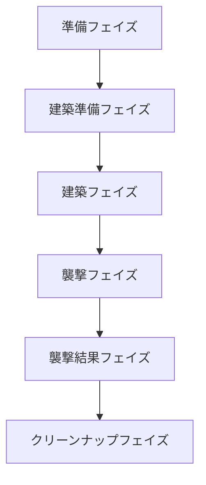

# Peaky-Pig-Palace

PPP game rule

- プレイヤー人数：4人のみ

## 準備フェイズ

- 各プレイヤーには4枚のカードが配られる
  - オオカミ
  - 藁の家（グレード１）
  - 木の家（グレード２）
  - レンガの家（グレード３）
- 各プレイヤーには5匹の労働ブタが配られる
- 親プレイヤーを決定する
- 準備フェイズの各処理が終わったら建築準備フェイズへ

## 建築準備フェイズ

- プレイヤーが持つカードが0枚の場合は4枚のカードが配られる
- プレイヤーがカードを持っている場合は建築フェイズへ

## 建築フェイズ

- 親から反時計回りにカードを1枚伏せ他状態で場に出す
- カードを一斉に公開し、場にオオカミが1枚以上あれば襲撃フェイズへ
- オオカミが1枚もない場合は建築準備フェイズへ

## 襲撃フェイズ

- オオカミを出したプレイヤーは親番に近い順に他のオオカミが攻撃していない自分以外のオオカミが場に存在する最もグレードの低い家を攻撃先に指定する
- オオカミは必ず何かに攻撃しなければならずレンガの家は攻撃先に指定できない
- オオカミが場に2枚以上ある場合、親番に近いオオカミが先に攻撃先を指定する
  - 2枚目以降のオオカミはすでに指定されている攻撃先に対して攻撃先に指定することはできない
  - オオカミ以外の攻撃先を指定できない場合は他のオオカミを指定しなければならない
- それぞれのプレイヤーの攻撃先の指定が終了したら襲撃結果フェイズへ

## 襲撃結果フェイズ

- オオカミからオオカミへの攻撃
  - 何も起きない
- オオカミから藁・木の家への攻撃
  - 攻撃されたプレイヤーからブタを1枚奪い自分の労働ブタとして加える
- 場に４種類のカード（オオカミ・藁の家・木の家・レンガの家）が揃った場合
  - 平和な世界となり何も起きない
- オオカミの攻撃先が存在しない場合（他3枚のカードがレンガの家）
  - オオカミが何もできずオオカミを出したプレイヤーのブタ2枚を捨札にする
- 襲撃結果フェイズが終了後、クリーンナップフェイズへ

## クリーンナップフェイズ

- ゲーム終了条件を満たしていない場合は親を反時計回りに交代し建築準備フェイズへ
- 自分プレイヤーの労働ブタが０になった場合、プレイヤーは脱落し以降のラウンドに参加できない
- ゲーム終了条件およびプレイヤーの勝利条件は以下の通り
  - 誰かのプレイヤーの労働ブタが6匹になる

---

### Flow

